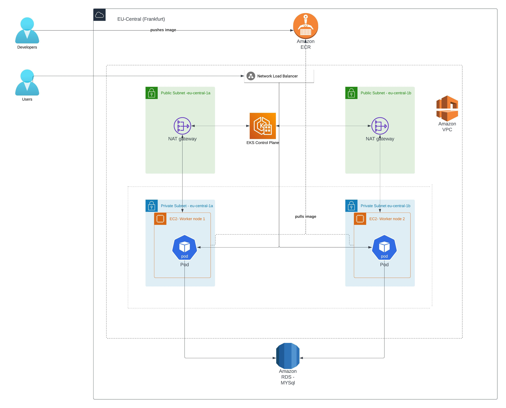

# Create EKS Cluster & Node Groups


## Step-00: Introduction & Pre-requisites
- Install/Setup pre-requisites
  - AWS Account with IAM user
  - AWS Cli installation **aws --version**  
  - eksctl installation **eksctl version**
  - kubectl **kubectl version**
- aws configure


## Step-01: Create EKS Cluster using eksctl
> It will take 10 to 15 minutes to create the Cluster Control Plane


Template: 
```
# Create Cluster
eksctl create cluster --name=eksdemo-mathema \
                      --region=eu-central-1 \
                      --zones=eu-central-1a,eu-central-1b \
                      --without-nodegroup 

# Get List of clusters
eksctl get cluster                  
```
**Output:**
- VPC
  - Public & Private Subnets
  - Internet gateway
  - NAT Gateway
  - Route tables
  - Subnets
  - Security Groups
- EKS Control plane
- IAM Roles & Policies


## Step-02: Create & Associate IAM OIDC Provider for our EKS Cluster
- To enable and use AWS IAM roles for Kubernetes service accounts on our EKS cluster, we must create &  associate OIDC identity provider.

```                   
# Template
eksctl utils associate-iam-oidc-provider \
    --region region-code \
    --cluster <cluter-name> \
    --approve

# Replace with region & cluster name
eksctl utils associate-iam-oidc-provider \
    --region eu-central-1 \
    --cluster eksdemo-mathema \
    --approve
```


## Step-03: Create Node Group with additional Add-Ons in Private Subnets
- These add-ons will create the respective IAM policies for us automatically within our Node Group role.


 ```
# Create Public/Private Node Group   
eksctl create nodegroup --cluster=eksdemo-mathema \
                        --region=eu-central-1 \
                        --name=eksdemo-mathema-ng-private1 \
                        --node-type=t3.medium \
                        --nodes=2 \
                        --nodes-min=2 \
                        --nodes-max=4 \
                        --node-volume-size=20 \
                        --ssh-access \
                        --ssh-public-key=eks-mathema-keypair \
                        --managed \
                        --asg-access \
                        --external-dns-access \
                        --full-ecr-access \
                        --appmesh-access \
                        --alb-ingress-access \
                        --node-private-networking
```

**Output:**
- Managed Node group
  - EC2 instances
  - Auto scaling
- IAM Roles & Policies

## Step-04: Verify Cluster & Nodes

### List Worker Nodes
```
# Update kubeconfig manually
aws eks --region eu-central-1 update-kubeconfig --name eksdemo-mathema

# List EKS clusters
eksctl get cluster

# List NodeGroups in a cluster
eksctl get nodegroup --cluster=eksdemo-mathema

# List Nodes in current kubernetes cluster
kubectl get nodes -o wide

# Our kubectl context should be automatically changed to new cluster
kubectl config view --minify
```


## Step-05: Prepare and push docker image
- Build application jar
mvn clean install -DskipTests=true

- Build docker image
docker build -t eks-demo .

- Navigate to AWS COnsole and create a repository eks-demo in the eu-central-1 region

- Docker login with ECR (using command line)
  first create a ECR repository .Navigate to the ECR repository and get the path and then  perform docker login:

          aws ecr get-login-password --region eu-central-1 | docker login --username AWS --password-stdin <customer id>.dkr.ecr.eu-central-1.amazonaws.com/eks-demo

You can get this comamnd from selecting the ecr repo from AWS console and then clicking on view push command button.

- Docker tag and push

       docker tag eks-demo:latest <customer id>.dkr.ecr.eu-central-1.amazonaws.com/eks-demo:latest
       docker push <customer id>.dkr.ecr.eu-central-1.amazonaws.com/eks-demo:latest

## Step-06: Install Kuberentes Artifacts


Navigate to the kuberentes artifacts folder and run the following command:


kubectl apply -f deployment.yaml

kubectl apply -f loadbalancer-service.yaml




**List Artifacts**:

kubectl get deployments

kubectl get pods

kubectl get svc

kubectl get ingress

## Step-07: Container Insights

- Assigning CloudWatchAgentServerPolicy Policy

On AWS Console ,Go to Services -> EC2 -> Worker Node EC2 Instance -> IAM Role -> Click on that role
Associate Policy: CloudWatchAgentServerPolicy

-  Download and edit container insights resource creator

    https://raw.githubusercontent.com/aws-samples/amazon-cloudwatch-container-insights/latest/k8s-deployment-manifest-templates/deployment-mode/daemonset/container-insights-monitoring/quickstart/cwagent-fluentd-quickstart.yaml

Replace {{cluster_name}} with your cluster name
Replace {{region_name}} with your region name

And save it as container_insights_fluent_d.yaml

- Create Deomon sets 
kubectl apply -f container_insights_fluent_d.yaml

- View insights
Navigate to Cloud watch->container insights


Check resources map, Log groups etc.


## Step-08:Clean up
- Delete load balancer related services
   - kubectl delete service expense-service-api
   - kubectl delete ingress ingress-expense-service

- Delete CloudWatchAgentServerPolicy

    On AWS Console ,Go to Services -> EC2 -> Worker Node EC2 Instance -> IAM Role 
   delete CloudWatchAgentServerPolicy

 **Rollback all manual changes, like changes to Security group, adding new policies etc.**
   
- Delete Node group

  eksctl delete nodegroup --cluster=<cluster name>  --name=<node group name>

- Delete Cluster

  eksctl delete cluster <cluster name>
  

## References
- EkSCTL 
  https://eksctl.io/

- AWS EKS
  https://docs.aws.amazon.com/eks/latest/userguide/getting-started-console.html

- Kubeclt & Kubernetes Cheat sheets
  https://kubernetes.io/docs/reference/kubectl/cheatsheet/

- AWS Load balancer Controllers
  https://kubernetes-sigs.github.io/aws-load-balancer-controller/v2.5/how-it-works/
  
- Udemy course
  https://www.udemy.com/share/103mNs3@EUuofX9N0-C_oZxMpS81ASRlLYuQ5SZRbjvXVb8givr0f_i42BOSpwRrqMicrm0K/
